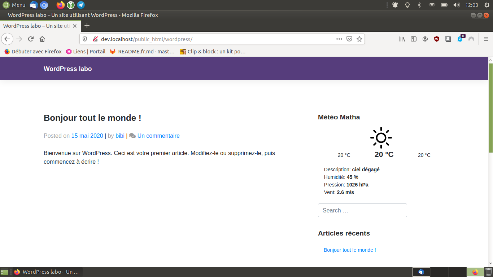

> **Description du projet**: Widget WordPress réalisé pour apprendre à développer un plugin, celui-ci affiche la météo d'une ville enregistrée. Il est nécessaire de demander un clé d'api sur le site [OpenWeather](https://openweathermap.org/). La clé est gratuite pour un usage personnel, il faut juste fournir une adresse courriel.

* * *

## Inspiration(s), source(s)

* bibibricodeur

## License

[The Unlicense](https://choosealicense.com/licenses/unlicense/)

### Fin
